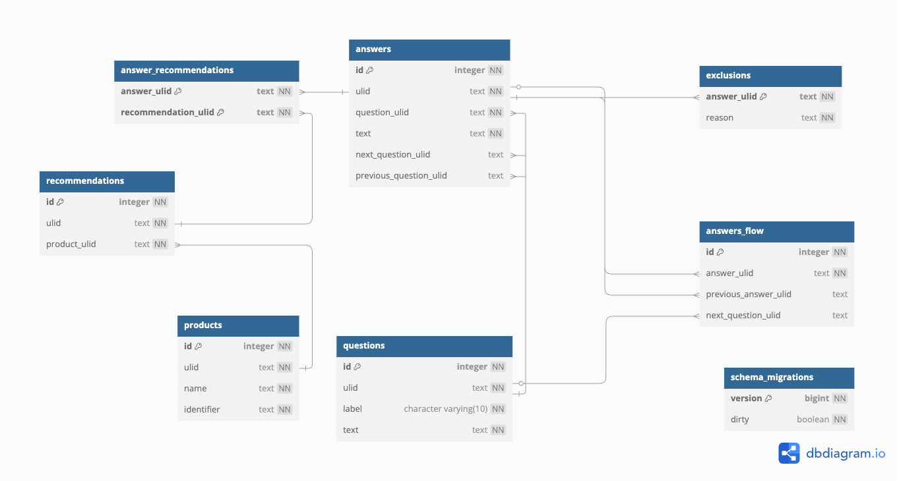
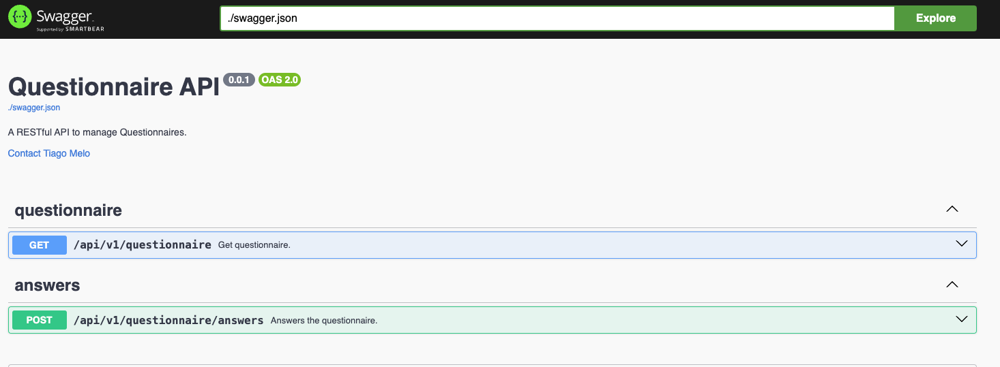

# questionnaire-rest-api

A REST API project in Go designed for managing a questionnaire. It demonstrates how to handle questionnaire flow with branching answers, dynamic jumps, and exclusion rules, ensuring a structured and flexible decision-making process.

## questionnaire Flow

| #  | Question | Answer | Next Step |
|----|----------|--------|-----------|
| 1  | Do you have difficulty getting or maintaining an erection? | **Yes** | Proceed to **Q2** |
|    | | **No** | No products available, **exit** |
| 2  | Have you tried any of the following treatments before? | **Viagra or Sildenafil** | Ask **Q2a** |
|    | | **Cialis or Tadalafil** | Ask **Q2b** |
|    | | **Both** | Ask **Q2c** |
|    | | **None of the above** | Proceed to **Q3** |
| 2a | Was the Viagra or Sildenafil product you tried before effective? | **Yes** | **Recommendation:** Sildenafil 50mg, proceed to **Q3** |
|    | | **No** | **Recommendation:** Tadalafil 20mg, proceed to **Q3** |
| 2b | Was the Cialis or Tadalafil product you tried before effective? | **Yes** | **Recommendation:** Tadalafil 10mg, proceed to **Q3** |
|    | | **No** | **Recommendation:** Sildenafil 100mg, proceed to **Q3** |
| 2c | Which is your preferred treatment? | **Viagra or Sildenafil** | **Recommendation:** Sildenafil 100mg, proceed to **Q3** |
|    | | **Cialis or Tadalafil** | **Recommendation:** Tadalafil 20mg, proceed to **Q3** |
|    | | **None of the above** | **Recommendation:** Sildenafil 100mg or Tadalafil 20mg, proceed to **Q3** |
| 3  | Do you have, or have you ever had, any heart or neurological conditions? | **Yes** | Exclude all recommendations, **exit** |
|    | | **No** | Proceed to **Q4** |
| 4  | Do any of the listed medical conditions apply to you? | **Significant liver problems (e.g., cirrhosis) or kidney problems** | Exclude all recommendations, **exit** |
|    | | **Currently prescribed nitrates (GTN, Isosorbide, etc.)** | Exclude all recommendations, **exit** |
|    | | **Abnormal blood pressure (<90/50 mmHg or >160/90 mmHg)** | Exclude all recommendations, **exit** |
|    | | **Condition affecting your penis (Peyronie's Disease, injuries, etc.)** | Exclude all recommendations, **exit** |
|    | | **I don't have any of these conditions** | Keep recommendations, proceed to **Q5** |
| 5  | Are you taking any of the following drugs? | **Alpha-blocker medication (e.g., Alfuzosin, Doxazosin, Tamsulosin, etc.)** | Exclude all recommendations, **exit** |
|    | | **Riociguat or other guanylate cyclase stimulators (for lung problems)** | Exclude all recommendations, **exit** |
|    | | **Saquinavir, Ritonavir, or Indinavir (for HIV)** | Exclude all recommendations, **exit** |
|    | | **Cimetidine (for heartburn)** | Exclude all recommendations, **exit** |
|    | | **I don't take any of these drugs** | Give the recommendation, **exit** |

---

### notes:
- If an exclusion condition is met at **Q3, Q4, or Q5**, **all recommendations are discarded, and the process exits**.
- If the user selects "None of the above" in **Q2c**, both **Sildenafil 100mg** and **Tadalafil 20mg** are recommended.


## requirements

1. [go](https://go.dev/)
2. [Docker](https://www.docker.com/)

## key features

- I've generated the basic REST API structure using an open source project of mine, [go-templates](https://github.com/tiagomelo/go-templates).
- Uses [Gorilla Mux](https://github.com/gorilla/mux) for HTTP routing.
- Implements custom middleware and [Gorilla Handlers](https://github.com/gorilla/handlers).
- Input validation with [validator](https://github.com/go-playground/validator).
- Database migrations handled by [golang-migrate](https://github.com/golang-migrate/migrate).
- API documentation through [go-swagger](https://github.com/go-swagger/go-swagger).
- Ensures 100% test coverage, including both unit and integration tests.

## endpoints

1. `GET api/v1/questionnaire`

This endpoint returns the questionnaire along with the answers and logical flow of questions:

```
{
    "questions": [
        {
            "ulid": "01JKZMRKJHW7MF4HKN0DAY0PAR",
            "label": "1",
            "text": "Do you have difficulty getting or maintaining an erection?",
            "answers": [
                {
                    "ulid": "01JKZMRNXVQ4QSJ548FBSV1GJX",
                    "text": "Yes",
                    "next_question_ulid": "01JKZMRKVYH2SQXS5R9EXQQYWR"
                },
                {
                    "ulid": "01JKZMRP780464QR5GRKKJFE38",
                    "text": "No",
                    "next_question_ulid": null
                }
            ]
        },
        {
            "ulid": "01JKZMRKVYH2SQXS5R9EXQQYWR",
            "label": "2",
            "text": "Have you tried any of the following treatments before?",
            "answers": [
                {
                    "ulid": "01JKZMRPGPWW4GF1B55BBS3R9Z",
                    "text": "Viagra or Sildenafil",
                    "next_question_ulid": "01JKZMRM5B09QNCFK46B5YRFP0"
                },
                {
                    "ulid": "01JKZMRPT3JY4TE22R00EQA8JN",
                    "text": "Cialis or Tadalafil",
                    "next_question_ulid": "01JKZMRMES1XQ5X3NKDTF5B0NZ"
                },
                {
                    "ulid": "01JKZMRQ3GS5731G5MJ9Y79DMH",
                    "text": "Both",
                    "next_question_ulid": "01JKZMRMR63Z3P8RAW74GYWRS4"
                },
                {
                    "ulid": "01JKZMRQCYDJCSNCBRFBSGHPHG",
                    "text": "None of the above",
                    "next_question_ulid": "01JKZMRN1KJSFJGP1693RX7PZ1"
                }
            ]
        },
        {
            "ulid": "01JKZMRM5B09QNCFK46B5YRFP0",
            "label": "2a",
            "text": "Was the Viagra or Sildenafil product you tried before effective?",
            "answers": [
                {
                    "ulid": "01JKZMRQPBA9KNNAV8GZ9B5WPV",
                    "text": "Yes",
                    "next_question_ulid": "01JKZMRN1KJSFJGP1693RX7PZ1"
                },
                {
                    "ulid": "01JKZMRQZRXD1QXQD7FSXDDYNW",
                    "text": "No",
                    "next_question_ulid": "01JKZMRN1KJSFJGP1693RX7PZ1"
                }
            ]
        },
        {
            "ulid": "01JKZMRMES1XQ5X3NKDTF5B0NZ",
            "label": "2b",
            "text": "Was the Cialis or Tadalafil product you tried before effective?",
            "answers": [
                {
                    "ulid": "01JKZMRR9582G1T895FHET9F9Q",
                    "text": "Yes",
                    "next_question_ulid": "01JKZMRN1KJSFJGP1693RX7PZ1"
                },
                {
                    "ulid": "01JKZMRRJK98K7BW5W1SR0JNCF",
                    "text": "No",
                    "next_question_ulid": "01JKZMRN1KJSFJGP1693RX7PZ1"
                }
            ]
        },
        {
            "ulid": "01JKZMRMR63Z3P8RAW74GYWRS4",
            "label": "2c",
            "text": "Which is your preferred treatment?",
            "answers": [
                {
                    "ulid": "01JKZMRRW0Q28YT4XNR16GP89N",
                    "text": "Viagra or Sildenafil",
                    "next_question_ulid": "01JKZMRN1KJSFJGP1693RX7PZ1"
                },
                {
                    "ulid": "01JKZMRS5DFMC97TRGKKWETT0E",
                    "text": "Cialis or Tadalafil",
                    "next_question_ulid": "01JKZMRN1KJSFJGP1693RX7PZ1"
                },
                {
                    "ulid": "01JKZMRSETM7J6C8J5JKC3BCH1",
                    "text": "None of the above",
                    "next_question_ulid": "01JKZMRN1KJSFJGP1693RX7PZ1"
                }
            ]
        },
        {
            "ulid": "01JKZMRN1KJSFJGP1693RX7PZ1",
            "label": "3",
            "text": "Do you have, or have you ever had, any heart or neurological conditions?",
            "answers": [
                {
                    "ulid": "01JKZMRSR7698EXDTAPWDQ0ETM",
                    "text": "Yes",
                    "next_question_ulid": null
                },
                {
                    "ulid": "01JKZMRT1MEB1360JZMF55ZF83",
                    "text": "No",
                    "next_question_ulid": "01JKZMRNB0GK5V1K2CNXFJTAAT"
                }
            ]
        },
        {
            "ulid": "01JKZMRNB0GK5V1K2CNXFJTAAT",
            "label": "4",
            "text": "Do any of the listed medical conditions apply to you?",
            "answers": [
                {
                    "ulid": "01JKZMRTB10CH599A7EYGSH9XW",
                    "text": "Significant liver problems (such as cirrhosis of the liver) or kidney problems",
                    "next_question_ulid": null
                },
                {
                    "ulid": "01JKZMRTMFSB4WTEXT75PJ6ZWZ",
                    "text": "Currently prescribed GTN, Isosorbide mononitrate, Isosorbide dinitrate , Nicorandil (nitrates) or Rectogesic ointment",
                    "next_question_ulid": null
                },
                {
                    "ulid": "01JKZMRTXWGKFN49AB53PJDPBP",
                    "text": "Abnormal blood pressure (lower than 90/50 mmHg or higher than 160/90 mmHg)",
                    "next_question_ulid": null
                },
                {
                    "ulid": "01JKZMRV78D9Q3XBMFKBAP4A36",
                    "text": "Condition affecting your penis (such as Peyronie's Disease, previous injuries or an inability to retract your foreskin)",
                    "next_question_ulid": null
                },
                {
                    "ulid": "01JKZMRVGNECK1R25XJJ33PCDD",
                    "text": "I don't have any of these conditions",
                    "next_question_ulid": "01JKZMRNMEE3V9HT8RHBV25QJR"
                }
            ]
        },
        {
            "ulid": "01JKZMRNMEE3V9HT8RHBV25QJR",
            "label": "5",
            "text": "Are you taking any of the following drugs?",
            "answers": [
                {
                    "ulid": "01JKZMRVT37ERXGE0WFYARWM4Y",
                    "text": "Alpha-blocker medication such as Alfuzosin, Doxazosin, Tamsulosin, Prazosin, Terazosin or over-the-counter Flomax",
                    "next_question_ulid": null
                },
                {
                    "ulid": "01JKZMRW3GSKKW7WBZ49SF5F53",
                    "text": "Riociguat or other guanylate cyclase stimulators (for lung problems)",
                    "next_question_ulid": null
                },
                {
                    "ulid": "01JKZMRWCX2F37QSSVF5PWA66P",
                    "text": "Saquinavir, Ritonavir or Indinavir (for HIV)",
                    "next_question_ulid": null
                },
                {
                    "ulid": "01JKZMRWPBX62ZYX5QDZKR6D9Q",
                    "text": "Cimetidine (for heartburn)",
                    "next_question_ulid": null
                },
                {
                    "ulid": "01JKZMRWZRHMSSZ5WQ2FDPX8A6",
                    "text": "I don't take any of these drugs",
                    "next_question_ulid": null
                }
            ]
        }
    ]
}
```

2. `POST api/v1/questionnaire/answers`

This endpoint gives recommendations based on the answers provided.

Example: 

input:
```
{
    "answers": [
        "01JKZMRNXVQ4QSJ548FBSV1GJX",
        "01JKZMRQ3GS5731G5MJ9Y79DMH",
        "01JKZMRSETM7J6C8J5JKC3BCH1",
        "01JKZMRT1MEB1360JZMF55ZF83",
        "01JKZMRVGNECK1R25XJJ33PCDD",
        "01JKZMRWZRHMSSZ5WQ2FDPX8A6"
    ]
}
```

output:

```
{
    "recommendations": [
        "Sildenafil 100mg",
        "Tadalafil 20mg"
    ]
}
```

## technical decisions

1. I'm using Postgresql.

2. Tables have their `id SERIAL PRIMARY KEY` as PK, and we use [ULID](https://wiki.tcl-lang.org/page/ULID for referencing. This is util for the [CTE](https://www.postgresql.org/docs/current/queries-with.html) I'm using:

```
...
latest_answer AS (
    -- Get the last answered question (if no exclusion exists)
    SELECT a.next_question_uuid
    FROM answers a
    WHERE a.uuid IN (SELECT answer_uuid FROM user_answers)
    ORDER BY a.id DESC -- here
    LIMIT 1
),
...
```

3. I'm using [CTE](https://www.postgresql.org/docs/current/queries-with.html) that retrieves the next question, recommendations, or exclusions, instead of issuing multiple queries to achieve the same results. This way, it is just one trip to the database.

4. Although the Frontend will control the questionnaire flux, I've implemented at least a basic answers sequence check to guard the backend. This logic could be revisited at any time, for sure. 

### **why ULID instead of UUID?**  

#### **1. lexicographical sorting**  
- **ULIDs are time-ordered**, meaning that newer records always appear later in a sorted index.
- This improves database **index locality**, leading to **faster** query performance when fetching recent records.

#### **2. readability**  
- ULIDs are **26-character base32 encoded** strings (e.g., `01JKZMRNXVQ4QSJ548FBSV1GJX`).
- UUIDs (`xxxxxxxx-xxxx-Mxxx-Nxxx-xxxxxxxxxxxx`) are **longer** and **harder to read**.

#### **3. performance in indexing & queries**  
- UUIDs are **random**, so inserting them into indexed tables can cause **fragmentation** in **B-Trees**, affecting performance.
- ULIDs, being **time-ordered**, avoid this issue by keeping index inserts sequential.

#### **4. compatibility with UUID**  
- ULIDs can still fit in `TEXT` columns.
- If necessary, we can convert them into a **UUID-like format**.

#### **5. ULIDs are unique across distributed systems**  
- Like UUIDs, ULIDs can be **generated without coordination**, ensuring uniqueness.

## data model explanation

The ERD was generated using [dbdiagram.io](https://dbdiagram.io/) and is structured to support a dynamic questionnaire flow with recommendations and exclusions. Below is a detailed breakdown of each table and its purpose.



### **1. `questions`**
This table holds the list of **questions** in the questionnaire.

| Column  | Type                  | Description |
|---------|-----------------------|-------------|
| `id`    | `integer NN`          | Primary key (auto-incremented). |
| `ulid`  | `text NN`             | Unique identifier for the question (ULID). |
| `label` | `character varying(10) NN` | Short label for the question (e.g., "Q1", "Q2a"). |
| `text`  | `text NN`             | Full question text. |

**purpose**: Defines each question in the questionnaire.

---

### **2. `answers`**
This table stores the possible **answers** to the questions.

| Column                 | Type      | Description |
|------------------------|-----------|-------------|
| `id`                  | `integer NN` | Primary key (auto-incremented). |
| `ulid`                | `text NN`  | Unique identifier for the answer (ULID). |
| `question_ulid`       | `text NN`  | Foreign key referencing `questions.ulid`. |
| `text`                | `text NN`  | Answer text (e.g., "Yes", "No"). |
| `next_question_ulid`  | `text`     | If answered, which question should be asked next? |
| `previous_question_ulid` | `text`  | The question that this answer belongs to. |

**purpose**: Holds answers linked to questions, allowing the system to determine the next step based on user input.

---

### **3. `answers_flow`**
This table maps the **flow of answers**, defining valid sequences.

| Column               | Type      | Description |
|----------------------|-----------|-------------|
| `id`                | `integer NN` | Primary key (auto-incremented). |
| `answer_ulid`       | `text NN`  | Foreign key referencing `answers.ulid`. |
| `previous_answer_ulid` | `text`  | Foreign key referencing the valid previous answer. |
| `next_question_ulid` | `text`    | Foreign key referencing `questions.ulid`, indicating the next question. |

**purpose**: Defines the allowed transitions between answers, ensuring users follow a valid path.

---

### **4. `exclusions`**
This table lists **conditions that exclude recommendations**.

| Column       | Type      | Description |
|-------------|-----------|-------------|
| `answer_ulid` | `text NN` | Foreign key referencing `answers.ulid`. |
| `reason`     | `text NN`  | Explanation for the exclusion. |

**purpose**: If an answer matches an exclusion, no recommendation is provided.

---

### **5. `recommendations`**
This table stores possible **recommendations** based on answers.

| Column         | Type      | Description |
|---------------|-----------|-------------|
| `id`          | `integer NN` | Primary key (auto-incremented). |
| `ulid`        | `text NN`  | Unique identifier for the recommendation (ULID). |
| `product_ulid` | `text NN` | Foreign key referencing `products.ulid`. |

**purpose**: Defines the available treatment/product recommendations.

---

### **6. `answer_recommendations`**
This is a **join table** linking answers to recommendations.

| Column              | Type      | Description |
|---------------------|-----------|-------------|
| `answer_ulid`      | `text NN`  | Foreign key referencing `answers.ulid`. |
| `recommendation_ulid` | `text NN` | Foreign key referencing `recommendations.ulid`. |

**purpose**: Maps which answers trigger specific recommendations.

---

### **7. `products`**
This table stores **products** that can be recommended.

| Column    | Type      | Description |
|-----------|-----------|-------------|
| `id`      | `integer NN` | Primary key (auto-incremented). |
| `ulid`    | `text NN`  | Unique identifier for the product (ULID). |
| `name`    | `text NN`  | Product name (e.g., "Sildenafil 50mg"). |
| `identifier` | `text NN` | Alternative identifier (e.g., SKU or internal code). |

**purpose**: Manages a list of available treatment options.

---

### **8. `schema_migrations`**
This table tracks **database migrations**.

| Column  | Type      | Description |
|---------|-----------|-------------|
| `version` | `bigint NN` | Migration version number. |
| `dirty`   | `boolean NN` | Indicates whether a migration was successful. |

**purpose**: Ensures the database schema is versioned and migrations are tracked.

---

### **summary of relationships**
- **One `question` -> Many `answers`** (each question has multiple possible answers).
- **One `answer` -> Leads to another question** (via `next_question_ulid`).
- **One `answer` -> Many `answers_flow`** (tracks the valid paths a user can take).
- **One `answer` -> Many `exclusions`** (if selected, recommendations are removed).
- **One `answer` -> Many `recommendations`** (certain answers lead to treatment suggestions).
- **One `recommendation` -> One `product`** (each recommendation links to a product).

---

### **why this design?**
This schema provides:
- **flexibility** – New questions, answers, and recommendations can be added without modifying code.  
- **scalability** – Supports complex branching logic efficiently.  
- **performance** – Optimized using **ULID-based lookups** and **predefined flows**.  

-> *With this setup, all logic is defined in the database, minimizing business logic in the API.*

## testing approach

1. Unit tests, aiming for **100% of coverage**
2. [Integration tests](./handlers/v1/v1_test.go) that tests both the REST API framework and expected behavior for getting recommendations. Since the logic is within the CTE, it makes sense to fully test it in a test database instance.

## running it

```
make run PORT=<port>
```

## running tests

```
make test
```

## coverage report

```
make coverage
```

## api documentation

Two files hold api's documentation: [doc.go](doc/doc.go) and [api.go](doc/api.go).

To re-generate [doc/swagger.json](doc/swagger.json),

```
make swagger
```

To view it on a browser,

```
make swaggger-ui
```

then visit `localhost`:



## available `Makefile` targets

```
$ make help
Usage: make [target]

  help                    shows this help message
  test                    run unit tests
  coverage                run unit tests and generate coverage report in html format
  start-psql              starts psql instance
  stop-psql               stops psql instance
  psql-console            opens psql terminal
  start-test-psql         starts psql test instance
  stop-test-psql          stops test psql instance
  psql-test-console       opens test psql terminal
  create-migration        creates a migration file
  migrate-up              runs migrations up to N version (optional)
  migrate-down            runs migrations down to N version (optional)
  migrate-version         shows current migration version number
  migrate-force-version   forces migrations to version V
  migrate-test-up         runs up N migrations on test db, N is optional (make migrate-up N=<desired_migration_number>)
  swagger                 generates api's documentation
  swagger-ui              launches swagger ui
  run                     runs the API
```

## **complexity Analysis**

### **data structure choice: answer flow as a graph**
The questionnaire flow can be modeled as a [**directed graph**](https://en.wikipedia.org/wiki/Directed_graph), where:
- **Nodes** represent answers.
- **Edges** represent valid transitions between answers.

Each answer can point to one or more possible next answers, forming a **directed acyclic graph (DAG)**. This structure is suitable because:
- It prevents cycles (e.g., going back to a previous question in an infinite loop).
- It allows efficient **validation of user responses** by checking valid transitions dynamically.
- It supports **dynamic jumps** (e.g., skipping optional steps when certain conditions allow it).

---

### **time complexity analysis**
The [`validateAnswerFlow`](./handlers/v1/answers/validate.go#L13) function ensures that the provided sequence of answers follows the expected flow. Let's analyze its complexity step by step.

#### **1. checking if the answer exists in the map**  
```go
flow, exists := answerFlow[ansULID]
if !exists {
    return errors.Errorf("invalid answer ULID: %s", ansULID)
}
```
- Since `answerFlow` is a **hash map**, looking up an answer **by its ULID** takes **O(1)** time.  
  -> *In simple terms, this means that no matter how many answers we have, checking if one exists is always fast.*

#### **2. verifying valid previous answers**  
```go
for _, prev := range flow.PreviousAnswers {
    if answeredSet[prev] {
        validPreviousFound = true
        break
    }
}
```
- Here, we iterate over **all possible previous valid answers**.
- If an answer has at most **k** possible previous answers, this step takes **O(k)** time.
- In the worst case, **k = O(n)** if an answer could follow any other answer (unlikely in a structured questionnaire).  
  -> *This means that if each answer could be preceded by multiple choices, we might have to check several of them, but usually, this is a small fixed number.*

#### **3. allowing dynamic jumps**  
```go
for prevAns, prevFlow := range answerFlow {
    if prevFlow.Next != nil && *prevFlow.Next == ansULID && answeredSet[prevAns] {
        validPreviousFound = true
        break
    }
}
```
- This loop goes through **all answers** in `answerFlow` to check if a **direct parent** allows a dynamic jump.
- Since there are **n** total answers, this step is **O(n)** in the worst case.  
  -> *This means we might have to scan all possible answers to see if a special transition is allowed, making it slower when there are many questions.*

#### **4. validating optional branch skipping**  
```go
for prevAns, prevFlow := range answerFlow {
    if prevFlow.Next != nil && *prevFlow.Next == ansULID {
        if len(prevFlow.PreviousAnswers) == 0 || answeredSet[prevAns] {
            validPreviousFound = true
            break
        }
    }
}
```
- Like the previous step, this loop **also iterates over all answers** (`O(n)`) to check if skipping is allowed.
- This means that in the worst case, it **adds another O(n) check**.  
  -> *Again, if there are a lot of questions, we might have to scan through all of them to determine if skipping is allowed.*

---

### **overall complexity**
Each answer validation step involves:
1. **O(1) lookup** in `answerFlow` (fast constant-time check).
2. **O(k) check** for previous answers (depends on how many options a question can have).
3. **O(n) loop** for dynamic jumps (worst case, checking all possible answers).
4. **O(n) loop** for skipping optional branches.

Since each answer in the sequence runs through these steps, the total worst-case complexity per answer is:

\[
O(n + k) \approx O(n)
\]

If the user answers **m** questions in their sequence, the total complexity is:

\[
O(m \cdot n)
\]

-> *This means that if the user provides a list of answers (`m`), for each answer, we might have to scan through all answers (`n`). So, as the number of questions increases, the time taken to validate a sequence grows proportionally.*

---

### **space complexity**
- `answerFlow` stores **n** answers → **O(n)**  
- `answeredSet` stores up to **m** answers provided by the user → **O(m)**  
- The function does not create extra lists or use recursion.

Overall, the space complexity is:

\[
O(n + m)
\]

-> *This means that our function does not use unnecessary memory. We only store the questionnaire structure (`n`) and the answers the user has provided (`m`), making it efficient in terms of storage.*

## references

1. Personal website: https://tiagomelo.info/
2. Linkedin: https://www.linkedin.com/in/tiagocmelo/
3. Github: https://github.com/tiagomelo